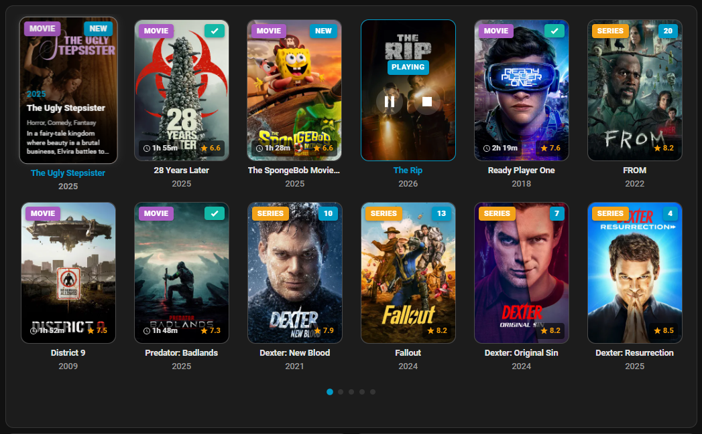
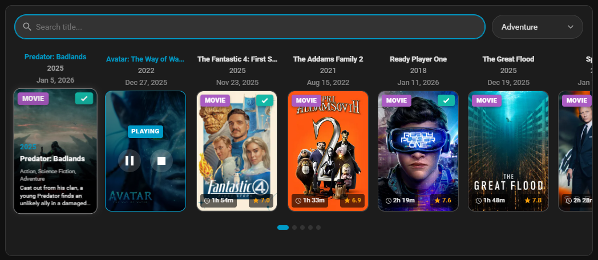
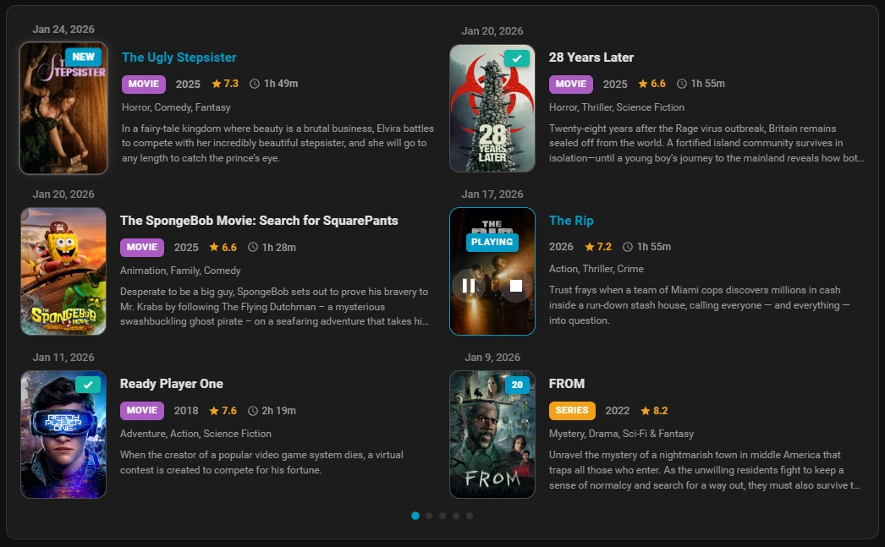
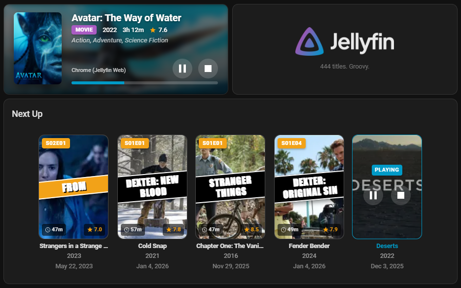
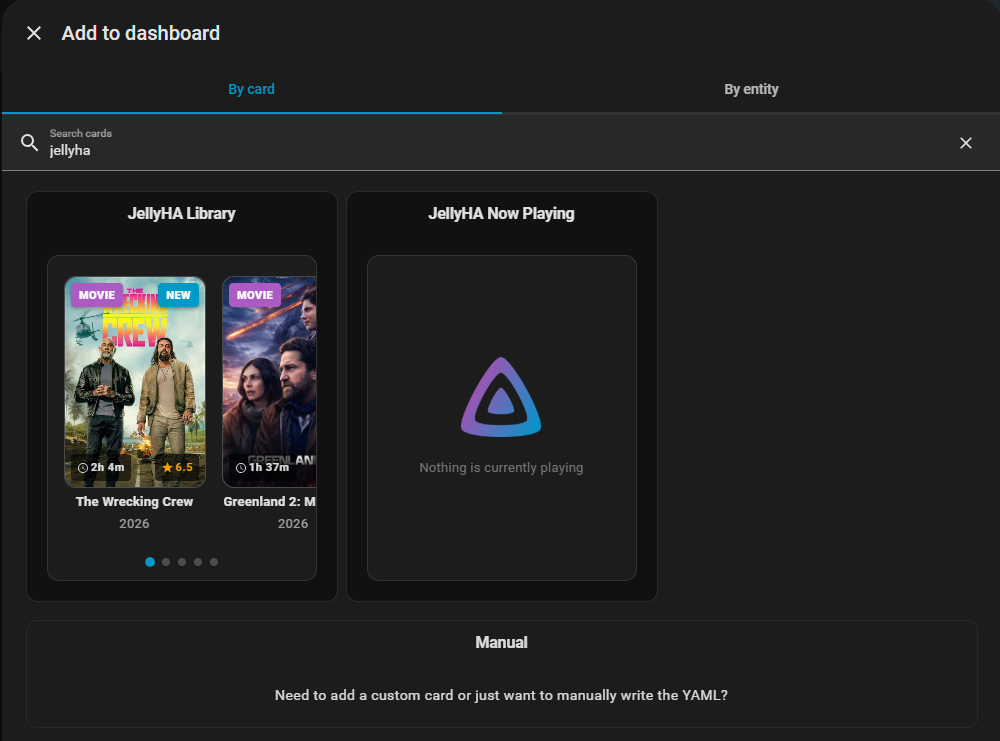

# ⏯️• Jellyfin+

[![HACS][hacs-badge]][hacs-url]
[![GitHub Release][release-badge]][release-url]

Jellyfin for Home Assistant

<div align="center">
  
  
  
  
  
  
</div>

## Features

- 🎵 Metadata for currently playing music (Song, Artist, Album, Timestamps, Coverart)
- 🔖 **Chapter support** with localized metadata (`app_name`, `chapter_no`, `chapter_name`) and seamless chapter skip controls
- 🎬 Display movies and TV shows from your library
- 📺 Cast media directly to Chromecast (Gen 1 supported)
- ⏯️ Full playback control: Play, Pause, Stop, Seek, Next/Previous Track
- 🎮 **Per-user media players** with transport and volume controls
- ⏭️ "Next Up" support to resume TV shows
- 🎨 Three layouts: Carousel, Grid, List
- 🌙 Automatic dark/light theme adaptation
- 🔗 Click to open in Jellyfin (new tab)
- ⭐ IMDB ratings for movies, TMDB for TV shows
- 🆕 "New" badge for recently added items
- 🔍 Built-in Search Bar with Title and Genre filtering
- 🔐 Secure login via Username/Password or API Key
- 🤖 Advanced automation triggers via custom sensors & services
- 📂 Full integration with Home Assistant Media Browser
- 💾 Local storage caching
- ⚡ Instant loading via WebSocket
- 🌍 7 languages: English, German, French, Spanish, Italian, Dutch, Slovenian
- 🎛️ Graphical card editor (no YAML required)

## Installation

⏯️• Jellyfin+ requires **two installation steps**: installing the integration and adding the dashboard card resource.

### Step 1: Install the Integration

#### Via HACS (Recommended)

Before installing JellyHA, ensure you have **HACS (Home Assistant Community Store)** installed.

Please follow the [official HACS installation guide](https://www.hacs.xyz/docs/use/download/download/) to install HACS on your Home Assistant instance.

**Option A: Using the Quick Link**

[](https://my.home-assistant.io/redirect/hacs_repository/?owner=Bitte-ein-Git&repository=ha_jellyfin&category=Integration)

**Option B: Manual Search**

1. Open HACS in Home Assistant
2. In the search bar, type **⏯️• Jellyfin+**

**Then:**

3. Click the **⏯️• Jellyfin+** integration and click **Download**
4. **Restart Home Assistant**

#### Manual Installation

1. Copy `custom_components/jellyha` to your `config/custom_components/` directory
2. **Restart Home Assistant**

### Step 2: Add Dashboard Card Resource

> **⚠️ Important:** This step is **required** even if you installed via HACS. The dashboard card will not work without it.

1. Go to **Settings** → **Dashboards**
2. Click **⋮** (three-dot menu) → **Resources**
3. Click **+ Add Resource**
4. Enter the URL:
   - URL: `/jellyha/jellyha-cards.js`
5. Select Resource type: **JavaScript Module**
6. Click **Create**

> **Note:** If you don't see the Resources menu, enable **Advanced Mode** in your user profile settings.

## Setup

> **⚠️ Note:** Only a single instance of this integration is supported. Please configure it once for your main user.

### Use the link to start the integration setup

[![My Home Assistant][my-ha-badge]][my-ha-url]

Then continue to step 3. and 4. below.

### Manually start the integration setup

1. Go to **Settings** → **Devices & Services** → **Add Integration**
2. Search for "⏯️• Jellyfin+"
3. Enter your Jellyfin server URL and select authentication method (**Username/Password** or **API Key**)
4. Enter your Jellyfin API key or credentials
5. Select the user and libraries to monitor
6. Click **Submit**
7. Add Device to the Area (optional)

> **Note:** You can update these credentials later by re-configuring the integration.


### Jellyfin API Key

To get your Jellyfin API key:

1. Open Jellyfin Dashboard
2. Go to **Administration** → **API Keys**
3. Click **+** to create a new key
4. Copy the generated key


## Library Card Configuration

The **JellyHA Library** provides a beautiful way to browse and play your media collection directly in Home Assistant.

> **ℹ️ Info:** Use **Add to dashboard** and search for JellyHA Card. YAML below is just informational.

```yaml
type: custom:jellyha-library-card
entity: sensor.jellyha_library
title: Jellyfin Library
layout: carousel
media_type: both
items_per_page: 3
max_pages: 5
```

### Options

| Option | Type | Default | Description |
|--------|------|---------|-------------|
| `entity` | string | **Required** | The sensor entity ID (e.g. `sensor.jellyha_library`) |
| `title` | string | `Jellyfin Library` | Card title |
| `layout` | string | `carousel` | Layout mode: `carousel`, `grid`, or `list` |
| `media_type` | string | `both` | Filter: `movies`, `series`, `next_up`, or `movies & series` |
| `columns` | number | `4` | Number of columns for grid & list layout. Changes to number of rows with Grid layout and Auto-Swipe On. |
| `items_per_page` | number | `3` | Items visible per page. **Note for Height Cut Off:** Use YAML editor to set > 8 rows. |
| `max_pages` | number | `5` | Maximum number of pages to display (0 = infinite) |
| `auto_swipe_interval` | number | `0` | Auto-scroll interval in seconds (0 = disabled) |
| `new_badge_days` | number | `3` | Items added within X days show "New" badge |
| `click_action` | string | `jellyfin` | Action on click: `jellyfin`, `more-info`, `cast`, `trailer`, or `none` |
| `hold_action` | string | `cast` | Action on hold: `jellyfin`, `cast`, `more-info`, `trailer`, or `none` |
| `double_tap_action` | string | `none` | Action on double tap: `jellyfin`, `cast`, `more-info`, `trailer`, or `none` |
| `default_cast_device` | string | `''` | Default media_player entity for casting |
| `show_now_playing` | boolean | `true` | Show currently playing item banner if active |
| `show_title` | boolean | `true` | Show media title |
| `show_year` | boolean | `true` | Show release year |
| `show_ratings` | boolean | `true` | Show combined rating |
| `show_runtime` | boolean | `true` | Show runtime duration |
| `show_date_added` | boolean | `false` | Show the date item was added in List view |
| `show_genres` | boolean | `true` | Show genres list |
| `show_description_on_hover` | boolean | `true` | Show overview when hovering/tapping |
| `show_media_type_badge` | boolean | `true` | Show Movie/Series badge |
| `show_watched_status` | boolean | `true` | Show watched checkmarks (Movies) and unplayed counts (Series) |
| `show_search` | boolean | `false` | Show Search Bar for filtering by Title and Genre |
| `metadata_position` | string | `below` | Position of text: `below` or `above` image |
| `sort_option` | string | `date_added_desc` | Sort order options |
| `enable_pagination` | boolean | `true` | Enable pagination dots |
| `show_pagination_dots` | boolean | `true` | Enable pagination dots visibility |
| `status_filter` | string | `all` | Filter Watch Status: `all`, `unwatched`, `watched` |
| `filter_favorites` | boolean | `false` | Filter Favorites (Show only favorite items) |
| `filter_newly_added` | boolean | `false` | Filter New Items (Show only new items) |
| `use_series_image` | boolean | `false` | (Next Up only) Show series cover instead of episode thumbnail |

> **⚠️ Performance Note:** Using **Auto Swipe** with a large number of items may impact performance on some devices. We recommend limiting the number of items for the best experience.

## Now Playing Card Configuration

The **JellyHA Now Playing Card** shows a rich media control interface for the currently playing item.

> **ℹ️ Info:** Use **Add to dashboard** and search for JellyHA Card. YAML below is just informational.

```yaml
type: custom:jellyha-now-playing-card
entity: sensor.jellyha_now_playing_admin # Replace with your user sensor
title: Now Playing
show_background: true
```

### Options

| Option | Type | Default | Description |
|--------|------|---------|-------------|
| `entity` | string | **Required** | The user-specific Now Playing sensor (e.g. `sensor.jellyha_now_playing_marko`) |
| `title` | string | `Jellyfin` | Optional title header |
| `show_background` | boolean | `true` | Show blurred backdrop fanart as background |
| `show_title` | boolean | `true` | Show media title text |
| `show_client` | boolean | `true` | Show client device name (e.g. "Chrome") |
| `show_media_type_badge` | boolean | `true` | Show badge (MOVIE, SERIES, EPISODE) |
| `show_genres` | boolean | `true` | Show genres list |
| `show_ratings` | boolean | `true` | Show community rating |
| `show_runtime` | boolean | `true` | Show runtime duration |
| `show_year` | boolean | `true` | Show release year |
| `use_series_image` | boolean | `false` | Show series cover instead of episode thumbnail |


## Sensors

JellyHA provides several sensors to monitor your Jellyfin server and library. All sensors are prefixed with `sensor.jellyha_` (unless a custom device name was used during setup).

### Library Sensors

| Entity ID | Description | State | Attributes |
|-----------|-------------|-------|------------|
| `sensor.jellyha_library` | Primary library sensor | Count of items | `server_name`, `movies`, `series`, `episodes` |
| `sensor.jellyha_favorites` | Favorite items | Count | - |
| `sensor.jellyha_unwatched` | Total unwatched content | Count | `movies`, `series` |
| `sensor.jellyha_unwatched_movies` | Unwatched movies | Count | - |
| `sensor.jellyha_unwatched_series` | Unwatched TV series | Count | - |
| `sensor.jellyha_unwatched_episodes` | Unwatched individual episodes | Count | - |
| `sensor.jellyha_watched` | Total watched content | Count | `movies`, `series` |
| `sensor.jellyha_watched_movies` | Fully watched movies | Count | - |
| `sensor.jellyha_watched_series` | Fully watched TV series | Count | - |
| `sensor.jellyha_watched_episodes` | Fully watched series count | Count | - |

### Server Status Sensors

| Entity ID | Description | State | Attributes |
|-----------|-------------|-------|------------|
| `sensor.jellyha_websocket` | WebSocket connection status | `connected`/`disconnected` | - |
| `sensor.jellyha_version` | Jellyfin server version | e.g. `10.11.6` | - |
| `sensor.jellyha_active_sessions` | Number of active playbacks | Count | `sessions` (list of active session info) |
| `sensor.jellyha_last_refresh` | Last time data was fetched | Timestamp | - |
| `sensor.jellyha_last_data_change` | Last time library data changed | Timestamp | - |
| `sensor.jellyha_refresh_duration` | Duration of the last library refresh | `5.2s`, `1m 30s` | `duration_seconds` (float) |

### User Sensors

| Entity ID Prefix | Description | State | Key Attributes |
|-----------|-------------|-------|----------------|
| `sensor.jellyha_now_playing_[user]` | Real-time monitoring for specific user | `playing`, `paused`, `idle` | `title`, `series_title`, `season`, `episode`, `progress_percent`, `image_url`, `media_type`, `client`, `device_name` |


## Media Players

JellyHA provides two types of media_player entities:

### Per-User Media Players

| Entity ID Pattern | Description | Supported Features |
|-----------|-------------|--------------------|
| `media_player.jellyha_[username]` | Tracks and controls each user's active playback session | **Transport:** Play, Pause, Stop, Seek, Next Track, Previous Track<br>**Volume:** Set Volume, Mute/Unmute<br>**Metadata:** Title, Series/Season/Episode, Image, Duration, Position |

**State Mapping:**
- `idle` — No active playback session
- `playing` — Media is currently playing
- `paused` — Media is paused

**Key Attributes:**
- `media_title` — Current media title
- `media_series_title` — TV series name (episodes only)
- `media_season` — Season number (episodes only)
- `media_episode` — Episode number (episodes only)
- `media_content_type` — `tvshow`, `movie`, `music`, or `video`
- `media_image_url` — Poster image URL
- `media_duration` — Total duration in seconds
- `media_position` — Current position in seconds
- `session_id` — Active Jellyfin session ID
- `device_name` — Client device name
- `client` — Client application name

**Example Usage:**
```yaml
# Pause playback
service: media_player.media_pause
target:
  entity_id: media_player.jellyha_admin

# Seek to 5 minutes
service: media_player.media_seek
target:
  entity_id: media_player.jellyha_admin
data:
  seek_position: 300

# Set volume to 50%
service: media_player.volume_set
target:
  entity_id: media_player.jellyha_admin
data:
  volume_level: 0.5
```

### Library Browser Media Player

| Entity ID | Description | Supported Features |
|-----------|-------------|--------------------|
| `media_player.jellyha_library_browser` | Browse and search your Jellyfin library | Browse Media, Play Media, Search Media |

This entity integrates with Home Assistant's Media Browser and allows you to explore your Jellyfin libraries directly from the Media panel.


## Services

JellyHA provides several services to control and manage your library.

| Service | Description | Parameters |
|---------|-------------|------------|
| `jellyha.play_on_chromecast` | Play an item on Chromecast with optimized transcoding. | `entity_id` (Req), `item_id` (Req) |
| `jellyha.refresh_library` | Force refresh library data from Jellyfin. | - |
| `jellyha.delete_item` | Delete an item from library/disk. ⚠️ **Use with caution.** | `item_id` (Req) |
| `jellyha.mark_watched` | Mark an item as watched or unwatched. | `item_id` (Req), `is_played` (Req) |
| `jellyha.update_favorite` | Add or remove an item from favorites. | `item_id` (Req), `is_favorite` (Req) |
| `jellyha.session_control` | Control playback (`Pause`, `Unpause`, `TogglePause`, `Stop`). | `session_id` (Req), `command` (Req) |
| `jellyha.session_seek` | Seek to position in ticks. Use `0` to rewind. | `session_id` (Req), `position_ticks` (Req) |
| `jellyha.search` | Search for media and return Item IDs. | `query` (Opt), `media_type` (Opt), `is_played` (Opt), `min_rating` (Opt), `season` (Opt), `episode` (Opt) |
| `jellyha.get_recommendations` | Get similar items based on item ID. | `item_id` (Req), `limit` (Opt) |
| `jellyha.get_item` | Get full details for an item. | `item_id` (Req) |


## Session & Now Playing Updates

JellyHA uses a **WebSocket-first, API-fallback** strategy for real-time session monitoring. This powers the `active_sessions` sensor and per-user `now_playing` sensors.

| Connection State | Update Method | Speed |
|------------------|---------------|-------|
| **WebSocket Connected** | Push updates from Jellyfin | Instant (~100ms) |
| **WebSocket Disconnected** | API polling every 5 seconds | Near real-time |

**How it works:**
1. On startup, JellyHA connects to the Jellyfin WebSocket and subscribes to session events
2. While connected, session updates are pushed instantly — no polling required
3. If WebSocket disconnects (network issue, server restart), it automatically falls back to API polling
4. When WebSocket reconnects, polling stops and push updates resume

The `sensor.jellyha_websocket` sensor shows the current connection status (`connected`/`disconnected`).


## Media Browser

JellyHA integrates directly with the Home Assistant Media Browser. You can explore your Jellyfin libraries, play media on supported players, and even stream directly to your browser, all without leaving Home Assistant.

1. Go to **Media** in the sidebar.
2. Select **⏯️• Jellyfin+**.
3. Browse your Movies, Series, and Music collections.


## Examples

### Automation Example: Play Random Unwatched Movie from 2025

This automation finds a highly-rated movie you haven't watched yet and casts it.

The `jellyha.search` service enables powerful automations by allowing you to find content dynamically.

```yaml
alias: Play Random Top 2025 Movie
description: Plays a random unwatched movie from 2025 with a rating above 7.
mode: restart
max_exceeded: silent
trigger:
  - platform: event
    event_type: call_service
    event_data:
      domain: automation
      service: trigger
      service_data:
        entity_id: automation.play_random_top_2025_movie
action:
  # 1. Search for candidates
  - service: jellyha.search
    data:
      media_type: Movie
      is_played: false
      year: 2025
      min_rating: 7
      limit: 50
    response_variable: search_result

  # 2. Check if we found anything
  - if:
      - condition: template
        value_template: "{{ search_result['items'] | count > 0 }}"
    then:
      # 3. Pick random item and play
      - service: jellyha.play_on_chromecast
        data:
          entity_id: media_player.office_tv
          item_id: "{{ (search_result['items'] | random)['id'] }}"
    else:
      # 4. Notify if nothing found
      - service: notify.persistent_notification
        data:
          message: "No unwatched 2025 movies with rating > 7 found."
```

### Automation Example: Pause Movie on Doorbell

This automation pauses playback automatically when the doorbell rings.

```yaml
alias: Pause Movie on Doorbell
description: "Pauses Jellyfin when the doorbell rings"
trigger:
  - trigger: state
    entity_id: binary_sensor.doorbell # Replace with your actual doorbell entity
    to: "on"
condition:
  # Only run if something is actually playing
  - condition: state
    entity_id: sensor.jellyha_now_playing_admin # Replace with your user sensor
    state: "playing"
actions:
  - action: jellyha.session_control
    data:
      # Dynamically get the session_id from the sensor attributes
      session_id: "{{ state_attr('sensor.jellyha_now_playing_admin', 'session_id') }}"
      command: Pause
mode: single
```

### Automation Example: Movie Time Lights

This automation turns off the lights when you start watching something.

```yaml
alias: Movie Time - Lights Off
description: "Turn off living room lights when movie starts playing"
trigger:
  - trigger: state
    entity_id: sensor.jellyha_now_playing_admin # Replace with your user sensor
    to: "playing"
conditions: []
actions:
  - action: light.turn_off
    target:
      entity_id: light.living_room
mode: single
```

### Automation Example: New Content Notification

Sends a notification to your phone when a new movie is added.

```yaml
alias: Notify New Movie
description: "Send notification when a new movie is added"
trigger:
  - trigger: state
    entity_id: sensor.jellyha_unwatched_movies
conditions:
  # Check if count increased (new item added)
  - condition: template
    value_template: "{{ trigger.to_state.state | int > trigger.from_state.state | int }}"
actions:
  # 1. Fetch the single newest movie
  - action: jellyha.search
    data:
      media_type: Movie
      limit: 1
    response_variable: new_items
  
  # 2. Send notification
  - action: notify.mobile_app_phone # Replace with your phone's notify service (check Developer Tools)
    data:
      title: New Movie Added
      message: "{{ new_items['items'][0]['name'] }} ({{ new_items['items'][0]['year'] }}) - Rating: {{ new_items['items'][0]['rating'] }}/10 is now available!"
      data:
        image: "{{ new_items['items'][0]['image_url'] }}"
mode: single
```

### Card Example: Display JellyHA Sensors in a Dashboard Card

```yaml
type: vertical-stack
cards:
  - type: markdown
    content: >
      # 🪼 JellyHA Sensors

      **Version:** {{ states('sensor.jellyha_version') }} | **Status:** {{
      states('sensor.jellyha_websocket') }}
  - type: entities
    title: Library Content
    state_color: true
    entities:
      - entity: sensor.jellyha_library
        name: Total Items
        icon: mdi:video-vintage
        secondary_info: last-changed
      - type: divider
      - entity: sensor.jellyha_unwatched_movies
        name: Unwatched Movies
        icon: mdi:movie-open
      - entity: sensor.jellyha_watched_movies
        name: Watched Movies
        icon: mdi:movie-check
      - type: divider
      - entity: sensor.jellyha_unwatched_series
        name: Unwatched Series
        icon: mdi:video-outline
      - entity: sensor.jellyha_watched_series
        name: Watched Series
        icon: mdi:video-check-outline
      - entity: sensor.jellyha_unwatched_episodes
        name: Unwatched Episodes
        icon: mdi:video
      - entity: sensor.jellyha_watched_episodes
        name: Watched Episodes
        icon: mdi:video-check
  - type: horizontal-stack
    cards:
      - type: gauge
        entity: sensor.jellyha_active_sessions
        name: Active Sessions
        min: 0
        max: 10
        severity:
          green: 0
          yellow: 3
          red: 7
      - type: tile
        entity: sensor.jellyha_favorites
        name: Favorites
        icon: mdi:heart
  - type: entities
    title: Activity & System
    entities:
      - entity: sensor.jellyha_now_playing_admin
        name: Admin
        icon: mdi:account
      - type: divider
      - entity: sensor.jellyha_last_library_update
        name: Last Library Update
      - entity: sensor.jellyha_last_refresh
        name: Last Refresh
      - entity: sensor.jellyha_refresh_duration
        name: Refresh Duration
```


## Troubleshooting

### "Custom element doesn't exist: jellyha-library-card"
This error means the dashboard cannot load the frontend code.
1. **Verify Installation**: Ensure you have added the correct Dashboard Resource URL: `/jellyha/jellyha-cards.js`.
2. **Clear Cache**: Restart Home Assistant and clear your browser cache (Ctrl + F5) or go into Incognito mode.
3. **Redownload**: If installed via HACS, go to HACS → JellyHA → ⋮ → Redownload (select "main" version if specifically troubleshooting a new fix).

### Card is empty ("No recent media found")
If the card shows "No recent media found" but you know you have items:
1. **Check Filters**: Ensure "Filter Favorites" or "Filter Unwatched" are not enabled in the card configuration if your items don't match those criteria.
2. **Check Logs**: Open the browser console (F12) to see if there are any specific errors.
3. **Verify Sensor**: Check `sensor.jellyha_library` in Developer Tools to ensure it has attributes (entry_id, etc.).

### "Connection lost" on startup
This usually indicates a duplicate command registration. Ensure you are running the latest version. We have implemented safeguards against this in v1.0.

## Support

- [Report an issue](https://github.com/Bitte-ein-Git/ha_jellyfin/issues)
- [Home Assistant Community](https://community.home-assistant.io/)

## Acknowledgments

This project was developed with the assistance of AI.

## License

MIT

## Disclaimer

**Personal Use Only**
This integration is provided as a neutral interface for your private media library. JellyHA does not provide, facilitate, or encourage the use of unauthorized or pirated content. By using this software, you agree that you are solely responsible for the legality of the media you host and stream.

[hacs-badge]: https://img.shields.io/badge/HACS-Custom-orange.svg
[hacs-url]: https://github.com/hacs/integration
[release-badge]: https://img.shields.io/github/v/release/Bitte-ein-Git/ha_jellyfin
[release-url]: https://github.com/Bitte-ein-Git/ha_jellyfin/releases
[my-ha-badge]: https://ha-link.heyfordy.de/badges/config_flow_start.svg
[my-ha-url]: https://my.home-assistant.io/redirect/config_flow_start?domain=jellyha
