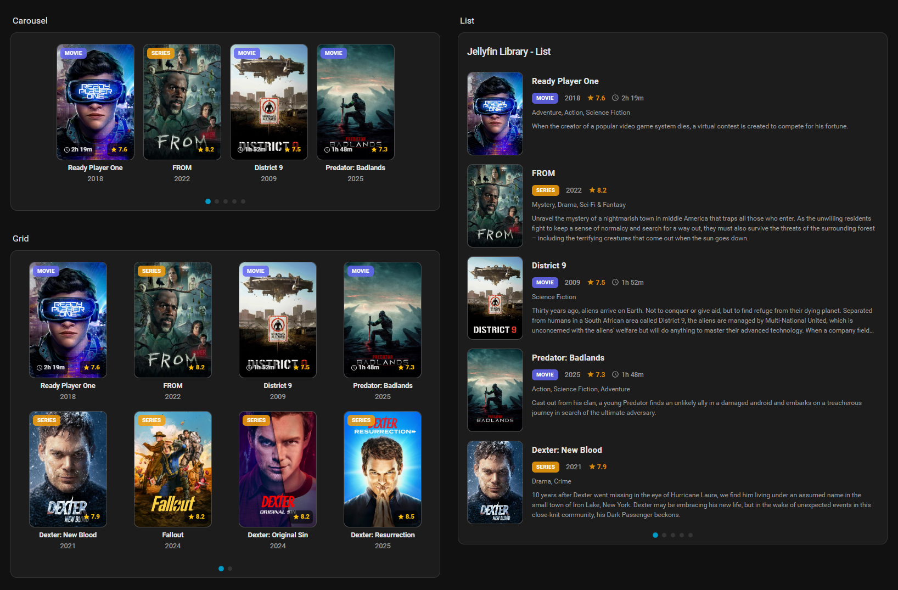

# JellyHA

[![HACS][hacs-badge]][hacs-url]
[![GitHub Release][release-badge]][release-url]

A Home Assistant integration and Lovelace card that displays media from your Jellyfin server.

**JellyHA Library** provides a beautiful way to showcase your media collection in Home Assistant.



## Features

- 🎬 Display movies and TV shows from your library
- 🎨 Three layouts: Carousel, Grid, List
- 🌙 Automatic dark/light theme adaptation
- 🔗 Click to open in Jellyfin (new tab)
- ⭐ IMDB ratings for movies, TMDB for TV shows
- 🆕 "New" badge for recently added items
- 📂 Full integration with Home Assistant Media Browser
- 💾 Efficient local storage caching (no database bloat)
- ⚡ Instant loading via WebSocket
- 🌍 6 languages: English, German, French, Spanish, Italian, Dutch
- 🎛️ Graphical card editor (no YAML required)

## Media Browser

JellyHA integrates directly with the Home Assistant Media Browser. You can explore your Jellyfin libraries, play media on supported players, and even stream directly to your browser, all without leaving Home Assistant.

1. Go to **Media** in the sidebar.
2. Select **JellyHA**.
3. Browse your Movies, Series, and Music collections.

## Installation

JellyHA requires **two installation steps**: installing the integration and adding the dashboard card resource.

### Step 1: Install the Integration

[![My Home Assistant][my-ha-badge]][my-ha-url]

#### Via HACS (Recommended)

1. Open HACS in Home Assistant
2. Go to **Integrations** → **⋮** → **Custom repositories**
3. Add repository URL: `https://github.com/zupancicmarko/JellyHA`
4. Select Type: **Integration**
5. Click **ADD**
6. Search for **JellyHA** in HACS Integrations
7. Click **Download**
8. **Restart Home Assistant**

#### Manual Installation

1. Copy `custom_components/jellyha` to your `config/custom_components/` directory
2. **Restart Home Assistant**

### Step 2: Add Dashboard Card Resource

> **⚠️ Important:** This step is **required** even if you installed via HACS. The dashboard card will not work without it.

1. Go to **Settings** → **Dashboards**
2. Click **⋮** (three-dot menu) → **Resources**
3. Click **+ Add Resource**
4. Enter the URL based on your installation method:
   - **HACS:** `/hacsfiles/jellyha/jellyha-cards.js`
   - **Manual:** `/local/community/jellyha/jellyha-cards.js` (ensure you copied `dist/jellyha-cards.js` to `config/www/community/jellyha/`)
5. Select Resource type: **JavaScript Module**
6. Click **Create**

> **Note:** If you don't see the Resources menu, enable **Advanced Mode** in your user profile settings.

## Setup

1. Go to **Settings** → **Devices & Services** → **Add Integration**
2. Search for "JellyHA"
3. Enter your Jellyfin server URL and API key
4. Select the user and libraries to monitor

## Card Configuration

Add the card to your dashboard:

```yaml
type: custom:jellyha-library-card
entity: sensor.jellyha_library
title: Jellyfin Library
layout: carousel
media_type: both
items_per_page: 3
max_pages: 5
```

### Options

| Option | Type | Default | Description |
|--------|------|---------|-------------|
| `entity` | string | **Required** | The sensor entity ID (e.g. `sensor.jellyha_library`) |
| `title` | string | `Jellyfin Library` | Card title |
| `layout` | string | `carousel` | Layout mode: `carousel`, `grid`, or `list` |
| `media_type` | string | `both` | Filter: `movies`, `series`, or `both` |
| `items_per_page` | number | `3` | Items visible per page (carousel) or initial Load (list) |
| `max_pages` | number | `5` | Maximum number of pages to display |
| `columns` | number | `4` | Number of columns for grid layout |
| `auto_swipe_interval` | number | `0` | Auto-scroll interval in seconds (0 = disabled) |
| `show_title` | boolean | `true` | Show media title |
| `show_year` | boolean | `true` | Show release year |
| `show_runtime` | boolean | `true` | Show runtime duration |
| `show_ratings` | boolean | `true` | Show combined rating |
| `show_media_type_badge` | boolean | `true` | Show Movie/Series badge |
| `show_watched_status` | boolean | `true` | Show watched checkmarks (Movies) and unplayed counts (Series) |
| `show_genres` | boolean | `true` | Show genres list |
| `show_description_on_hover` | boolean | `true` | Show overview when hovering/tapping |
| `show_pagination` | boolean | `true` | Show pagination dots |
| `show_date_added` | boolean | `false` | Show the date item was added in List view |
| `show_now_playing` | boolean | `true` | Show currently playing item banner if active |
| `metadata_position` | string | `below` | Position of text: `below` or `above` image |
| `rating_source` | string | `auto` | Rating source: `auto`, `imdb`, `tmdb`, or `jellyfin` |
| `new_badge_days` | number | `3` | Items added within X days show "New" badge |
| `theme` | string | `auto` | Theme: `auto`, `dark`, or `light` |
| `click_action` | string | `jellyfin` | Action on click: `jellyfin`, `more-info`, `play`, or `none` |
| `hold_action` | string | `cast` | Action on hold: `cast`, `jellyfin`, `more-info`, or `none` |
| `default_cast_device` | string | `''` | Default media_player entity for casting |
| `filter_favorites` | boolean | `false` | Filter to show only favorite items |
| `filter_unwatched` | boolean | `false` | Filter to show only unwatched items |

## API Key

To get your Jellyfin API key:

1. Open Jellyfin Dashboard
2. Go to **Administration** → **API Keys**
3. Click **+** to create a new key
4. Copy the generated key

## Services

JellyHA provides several services to control and manage your library.

### `jellyha.play_on_chromecast`
Plays a Jellyfin item on a Google Cast device with optimized transcoding settings (Tuned 2026 Strategy).
- **entity_id** (Required): The media player entity ID of the Chromecast (e.g. `media_player.living_room_tv`).
- **item_id** (Required): The Jellyfin Item ID to play.

### `jellyha.refresh_library`
Forces a manual refresh of the library data from the Jellyfin server. This is useful for automations or scripts.

### `jellyha.delete_item`
Permanently deletes an item from your Jellyfin library/disk. ⚠️ **Use with caution.**
- **item_id** (Required): The Jellyfin Item ID to delete.

## Troubleshooting

### Card is empty ("No recent media found")
If the card shows "No recent media found" but you know you have items:
1. **Check Filters**: Ensure "Filter Favorites" or "Filter Unwatched" are not enabled in the card configuration if your items don't match those criteria.
2. **Check Logs**: Open the browser console (F12) to see if there are any specific errors.
3. **Verify Sensor**: Check `sensor.jellyha_library` in Developer Tools to ensure it has attributes (entry_id, etc.).

### "Connection lost" on startup
This usually indicates a duplicate command registration. Ensure you are running the latest version. We have implemented safeguards against this in v1.0.

## Support

- [Report an issue](https://github.com/zupancicmarko/jellyha/issues)
- [Home Assistant Community](https://community.home-assistant.io/)

## License

MIT

[hacs-badge]: https://img.shields.io/badge/HACS-Custom-orange.svg
[hacs-url]: https://github.com/hacs/integration
[release-badge]: https://img.shields.io/github/v/release/zupancicmarko/jellyha
[release-url]: https://github.com/zupancicmarko/jellyha/releases
[my-ha-badge]: https://my.home-assistant.io/badges/config_flow_start.svg
[my-ha-url]: https://my.home-assistant.io/redirect/config_flow_start?domain=jellyha
